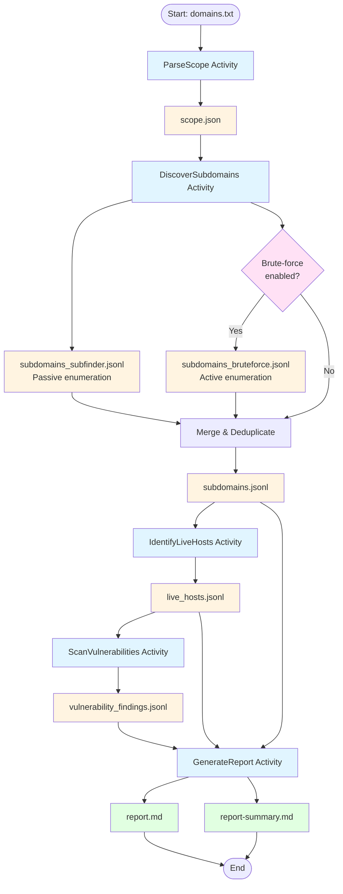

# Cyberwise 25 Final Project: Passive Reconnaissance Pipeline

A Go-based workflow orchestrating industry-standard recon tools (Subfinder → puredns (optional) → httpx → nuclei) to discover subdomains, identify live web assets, and detect vulnerabilities across multiple domains in parallel.

## Overview

This project implements an automated passive reconnaissance pipeline using [go-workflows](https://github.com/cschleiden/go-workflows). The pipeline primarily uses passive enumeration (Subfinder) but can be enhanced with active brute-force enumeration (puredns) for comprehensive subdomain discovery. It is designed to:

- **Parallelize domain processing**: Efficiently handle multiple domains concurrently.
- **Configurable scanning**: customizable via `config.yaml`.
- **Hybrid enumeration**: Combines passive (Subfinder) and active (puredns brute-force) subdomain discovery methods.
- **Structured Reporting**: Generates Markdown reports and JSONL data for findings.
- **Resilience**: Includes retry logic for transient errors.

## Pipeline Architecture

The following diagram illustrates the pipeline workflow, showing activities and the files they produce:



**Legend:**

- 🔵 **Blue boxes**: Activities (workflow steps)
- 🟡 **Yellow boxes**: Intermediate/output files (JSONL/JSON)
- 🟣 **Pink diamond**: Conditional step (brute-force enumeration)
- 🟢 **Green boxes**: Final report files

## Documentation

- [Project Specification](docs/spec.md): Detailed project requirements and architecture.

## Prerequisites

- Go 1.25+
- [Subfinder](https://github.com/projectdiscovery/subfinder) installed and in your PATH.
- [httpx](https://github.com/projectdiscovery/httpx) installed and in your PATH.
- [nuclei](https://github.com/projectdiscovery/nuclei) installed and in your PATH.
- [puredns](https://github.com/d3mondev/puredns) (optional) - Required only if brute-force subdomain enumeration is enabled in `config.yaml`.
- [massdns](https://github.com/blechschmidt/massdns) (optional) - Required dependency of puredns. Install if using brute-force enumeration.

## Installation

Clone the repository:

```bash
git clone https://github.com/michelemendel/cw25_final_project.git
cd cw25_final_project
```

### Installing Required Tools

**For macOS:** Install the required reconnaissance tools using Homebrew:

```bash
brew install subfinder
brew install httpx
brew install nuclei
```

**Installing puredns (for brute-force enumeration):**

puredns is used for brute-force subdomain enumeration when enabled in the configuration. It requires `massdns` as a dependency.

**1. Install massdns (required dependency):**

**For macOS:**

```bash
brew install massdns
```

**For Linux:**

```bash
# Clone and build from source
git clone https://github.com/blechschmidt/massdns.git
cd massdns
make
sudo cp bin/massdns /usr/local/bin/
```

**2. Install puredns:**

```bash
go install github.com/d3mondev/puredns/v2@latest
```

Make sure `$GOPATH/bin` or `$GOBIN` is in your PATH. You can verify installation by running:

```bash
puredns --version
massdns --version  # Verify massdns is also available
```

**Download a wordlist for brute-force:**

If you plan to use brute-force enumeration, you'll need a wordlist:

```bash
mkdir -p wordlists
wget https://raw.githubusercontent.com/danielmiessler/SecLists/master/Discovery/DNS/subdomains-top1million-5000.txt -O wordlists/subdomains-top1million-5000.txt
```

Or use any other DNS wordlist from [SecLists](https://github.com/danielmiessler/SecLists/tree/master/Discovery/DNS).

Note: These installation instructions are for macOS. For other operating systems, please refer to the official installation guides for each tool:

- [Subfinder Installation](https://github.com/projectdiscovery/subfinder#installation)
- [httpx Installation](https://github.com/projectdiscovery/httpx#installation)
- [nuclei Installation](https://github.com/projectdiscovery/nuclei#installation)
- [puredns Installation](https://github.com/d3mondev/puredns#installation)
- [massdns Installation](https://github.com/blechschmidt/massdns#installation) (required by puredns)

## Usage

### Configuration

Edit `config.yaml` to configure scanner settings, timeout, output directory, and other settings.
Edit `domains.txt` to add the list of root domains to scan.

**Brute-Force Subdomain Enumeration:**

The pipeline supports brute-force subdomain enumeration using puredns. This is useful for finding subdomains that aren't discoverable through passive enumeration (e.g., test sites or internal domains).

**Passive vs Active Enumeration:**

- **Subfinder (Passive)**: Queries public databases and sources without directly interacting with the target domain's infrastructure. It searches:

  - Certificate Transparency logs
  - Public DNS databases
  - Search engines and public APIs
  - Historical DNS records

  This method is "passive" because it uses already-collected public data and doesn't send queries directly to the target's DNS servers. It's fast, stealthy, and won't trigger alerts, but can only find subdomains that have been publicly exposed.

- **puredns (Active)**: Performs direct DNS queries to resolve potential subdomain names. It:

  - Sends DNS queries directly to DNS resolvers for each wordlist entry
  - Tests if subdomains exist by attempting to resolve them
  - Interacts directly with DNS infrastructure

  This method is "active" because it directly queries DNS servers (either the target's authoritative DNS or public resolvers). It can find subdomains that aren't in public databases, but is slower, more detectable, and generates network traffic.

**To enable brute-force enumeration:**

1. Set `brute_force: true` in the `subfinder` section of `config.yaml`
2. Specify the path to your wordlist file: `wordlist: "wordlists/subdomains-top1million-5000.txt"`
3. Optionally adjust the thread count: `brute_force_threads: 100`
4. Optionally specify a custom DNS resolvers file: `resolvers_file: "path/to/resolvers.txt"` (if not specified, defaults to `~/.config/puredns/resolvers.txt` and will be auto-generated if missing)

When enabled, the pipeline will:

- First run Subfinder (passive enumeration)
- Then run puredns brute-force (if enabled)
- Merge and deduplicate results from both methods

**Note:** Brute-force is slower than passive enumeration but can find subdomains that aren't in public sources.

### Build and Run

To build the project:

```bash
make build
```

This will create the executable at `bin/recon-pipeline`.

Then run:

```bash
make run
```

To build and run the pipeline in one fell swoop:

```bash
make build-run
```

### Output

Results are saved in the `out/` directory (or as configured in `config.yaml`), organized by domain.

- `scope.json` - Domain scope configuration with timestamp metadata
- `subdomains.jsonl` - Discovered subdomains from Subfinder (passive enumeration) and/or puredns (active brute-force enumeration), merged and deduplicated (JSONL format)
- `live_hosts.jsonl` - Live web hosts identified by httpx with URL, status code, title, technology stack, IP, and ASN information
- `vulnerability_findings.jsonl` - Vulnerability findings from nuclei scans including severity, CVE IDs, and matched endpoints
- `report.md` - Per-domain markdown report with summary statistics and vulnerability findings table

Global summary: `out/report-summary.md` - Aggregated statistics across all scanned domains
